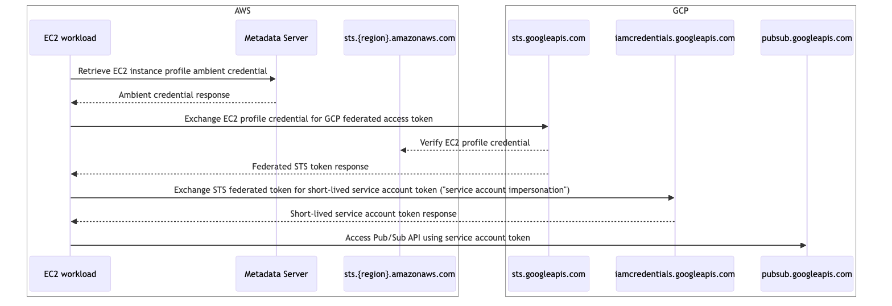
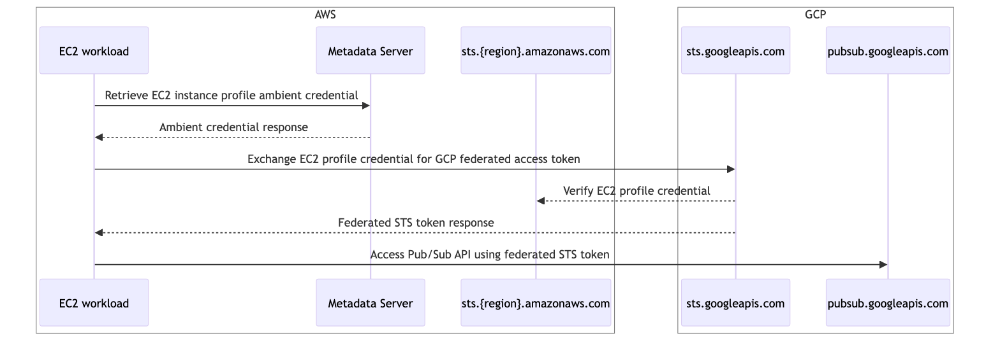
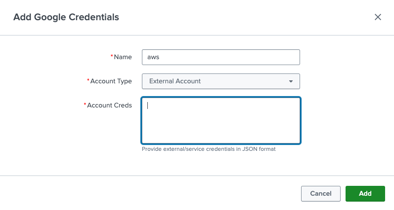
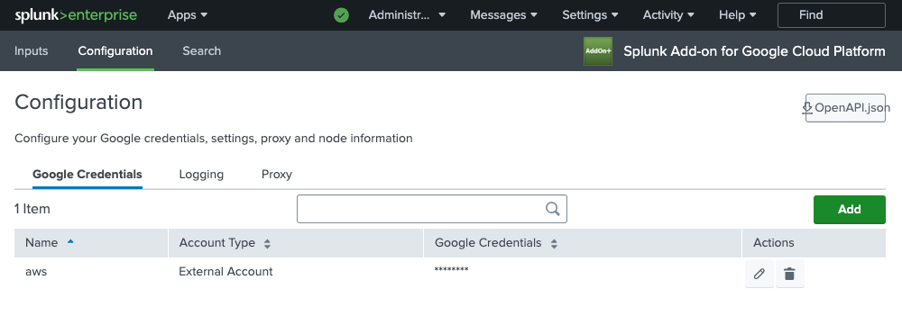
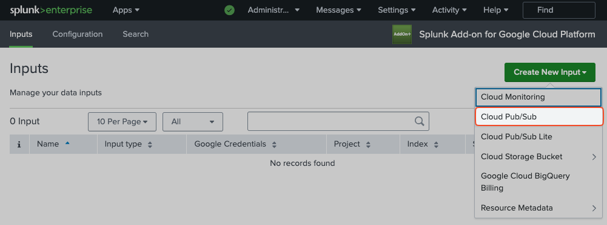
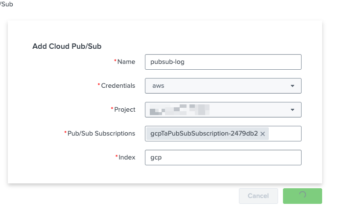
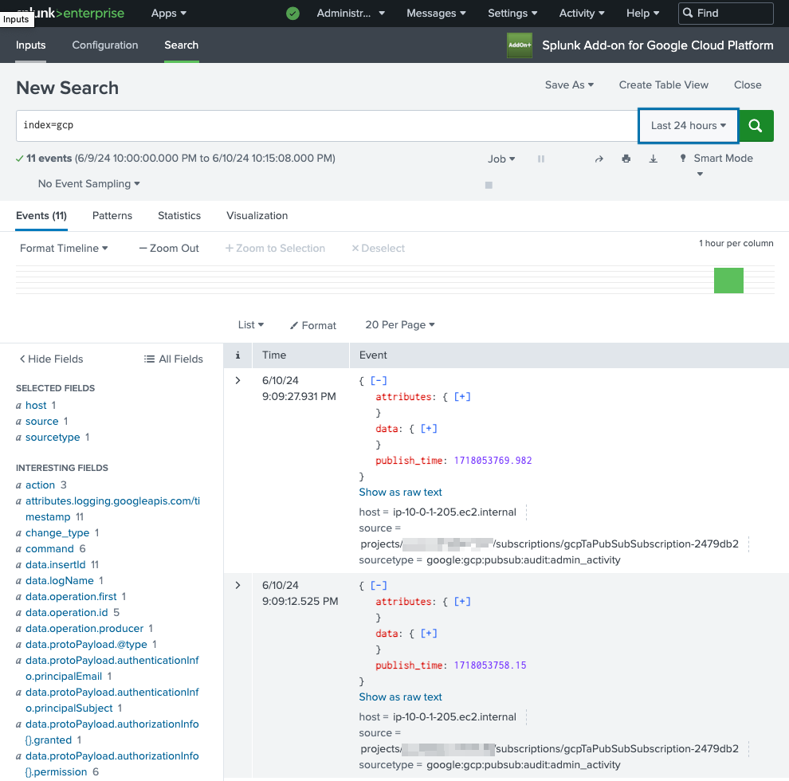

# Workload Identity Federation with the Splunk Add-on for Google Cloud Platform

## Introduction

[Service account keys](https://cloud.google.com/iam/docs/keys-create-delete#creating) are credentials that allows applications or services to authenticate and authorize actions on Google Cloud resources without using user credentials. While convenient, securing a service account key presents significant security challenges. To reduce the risk of compromised keys, organizations must implement a service account key lifecycle management process that includes regular rotation and revocation. Many organizations have strict policies which prohibit the use of service account keys entirely. Recognizing the associated risks of service account keys, Google has recently introduced strong default [Organization Policy](https://cloud.google.com/resource-manager/docs/organization-policy/overview) settings which [disable the creation of service account keys for new Google Cloud organizations](https://cloud.google.com/blog/products/identity-security/introducing-stronger-default-org-policies-for-our-customers).

To address these challenges, Google has introduced [Workload Identity Federation](https://cloud.google.com/iam/docs/workload-identity-federation), allowing applications to access cloud resources without requiring service account keys. Instead, external identity providers are used for authentication. This feature enhances security and simplifies identity management by leveraging federated credentials from trusted third-party providers such as AWS, Azure, or any OIDC-compliant provider.

Splunk has recently introduced [support for Workload Identity Federation](https://docs.splunk.com/Documentation/AddOns/released/GoogleCloud/Setupv1) in version [4.4.0](https://docs.splunk.com/Documentation/AddOns/released/GoogleCloud/Releasehistory#Version_4.4.0) of the [Splunk Add-on for Google Cloud Platform](https://splunkbase.splunk.com/app/3088). This update aims to support the use case of running the add-on as a workload in Azure or AWS without the need to create a service account key. Instead, customers will be able to leverage the ["ambient" machine credential](https://cloud.google.com/iam/docs/best-practices-for-using-workload-identity-federation#ambient-credentials) available in the cloud provider environment.

This article outlines the steps required to configure the add-on and prepare the Google Cloud environment for use with an AWS EC2 instance profile credential. Once configured, the AWS workload credential will be used to perform API calls into a Google Cloud environment, thus eliminating the need for a service account key. Please refer to Google Cloud documentation for [examples beyond AWS](https://cloud.google.com/iam/docs/workload-identity-federation#providers).

## Prerequisites

* Splunk indexer or heavy forwarder workload hosted in AWS EC2 running version 4.4.0 or greater of the [Splunk Add-On for Google Cloud Platform](https://splunkbase.splunk.com/app/3088)
* An instance profile role must be associated with the EC2 host
* Pub/Sub subscription configured with Google Cloud logs

## Authentication Sequence

There are two Workload Identity Federation authentication sequences possible. The first authentication sequence requires the use of service account impersonation in the GCP project. This method will provide compatability with all Google Cloud APIs and hence all inputs available in the Splunk Add-on for Google Cloud Platform will function as expected.

The second method does not require service account impersonation and instead uses the federated STS token directly with Google Cloud APIs. Although most Google Cloud APIs support Workload Identity Federation, some APIs such as the Pub/Sub Lite API have [limitations](https://cloud.google.com/iam/docs/federated-identity-supported-services) and are not compatible.

For the widest guaranteed API compatability, use the full service account impersonation authentication sequence. As more Google Cloud APIs continue to provide federated STS token compatability, this recommendation is subject to change.

### Service account impersonation sequence

The following diagram outlines the IAM component authentication sequence using service account impersonation. This is the recommended sequence for use with the Splunk Add-on for Google Cloud Platform.



### Native STS token sequence

The following diagram outlines the IAM component authentication sequence using federated STS tokens without a service account impersonation step. Do not use this sequence if your add-on use case involves Pub/Sub Lite.



## Configuration

### Google Cloud

Select an authentication sequence before proceeding. Use "service account impersonation" sequence if unsure.

#### Service account impersonation sequence (recommended)

This is the recommended authenticaiton sequence as it provides the widest compatability with Google Cloud APIs.

##### Prepare environment variables

Export several environment variables for use throughout the configuration instructions.

```
# Start of environment specific variables. Replace them appropriately.
export AWS_ACCOUNT_ID=<AWS_ACCOUNT_ID>
export AWS_ASSUMED_ROLE=<AWS_ASSUMED_ROLE>
export PROJECT_ID=<PROJECT_ID>
export PROJECT_NUMBER=<PROJECT_NUMBER>
# End of environment specific variables.
export SA_NAME=gcp-ta-sa
export SA_EMAIL=${SA_NAME}@${PROJECT_ID}.iam.gserviceaccount.com
export IDENTITY_POOL=aws-wli-pool
export IDENTITY_PROVIDER=aws-wli-pp
export PRINCIPAL_SET=principalSet://iam.googleapis.com/projects/${PROJECT_NUMBER}/locations/global/workloadIdentityPools/${IDENTITY_POOL}/attribute.aws_role/${AWS_ASSUMED_ROLE}
export CREDENTIAL_CONFIG_FILE=aws_credential_config.json
```

##### Create the workload identity pool

```
gcloud iam workload-identity-pools create ${IDENTITY_POOL} \
  --project=${PROJECT_ID} \
  --location="global" \
  --display-name="AWS identity pool"
```

##### Create AWS workload identity pool provider

```
gcloud iam workload-identity-pools providers create-aws ${IDENTITY_PROVIDER} \
  --project=${PROJECT_ID} \
  --location="global" \
  --workload-identity-pool=${IDENTITY_POOL} \
  --account-id=${AWS_ACCOUNT_ID} \
  --attribute-mapping="google.subject=assertion.arn,attribute.account=assertion.account,attribute.aws_role=assertion.arn.extract('assumed-role/{role}/'),attribute.aws_ec2_instance=assertion.arn.extract('assumed-role/{role_and_session}').extract('/{session}')"
```

##### Create a service account

```
gcloud iam service-accounts create ${SA_NAME} --project=${PROJECT_ID}
```

##### Grant project-wide Pub/Sub permissions to service account

```
gcloud projects add-iam-policy-binding ${PROJECT_ID} \
  --member=serviceAccount:${SA_EMAIL} \
  --role=roles/pubsub.viewer
```

```
gcloud projects add-iam-policy-binding ${PROJECT_ID} \
  --member=serviceAccount:${SA_EMAIL} \
  --role=roles/pubsub.subscriber
```

##### Grant workload identity pool principal ability to impersonate service account

```
gcloud iam service-accounts add-iam-policy-binding ${SA_EMAIL} \
  --project=${PROJECT_ID} \
  --role="roles/iam.workloadIdentityUser" \
  --member=${PRINCIPAL_SET}
```

##### Create credential configuration file

```
gcloud iam workload-identity-pools create-cred-config \
    projects/${PROJECT_NUMBER}/locations/global/workloadIdentityPools/${IDENTITY_POOL}/providers/${IDENTITY_PROVIDER} \
    --service-account=${SA_EMAIL} \
    --aws \
    --enable-imdsv2 \
    --output-file=${CREDENTIAL_CONFIG_FILE}
```

Download the generated credential configuration file. It will be uploaded to the Splunk server in the next section. Note that this configuration file does not contain secret key material. The following is an example configuration file:

```
{
  "universe_domain": "googleapis.com",
  "type": "external_account",
  "audience": "//iam.googleapis.com/projects/REDACTED/locations/global/workloadIdentityPools/test2-aws-wli-pool/providers/test2-aws-wli-pp",
  "subject_token_type": "urn:ietf:params:aws:token-type:aws4_request",
  "token_url": "https://sts.googleapis.com/v1/token",
  "credential_source": {
    "environment_id": "aws1",
    "region_url": "http://169.254.169.254/latest/meta-data/placement/availability-zone",
    "url": "http://169.254.169.254/latest/meta-data/iam/security-credentials",
    "regional_cred_verification_url": "https://sts.{region}.amazonaws.com?Action=GetCallerIdentity&Version=2011-06-15",
    "imdsv2_session_token_url": "http://169.254.169.254/latest/api/token"
  },
  "service_account_impersonation_url": "https://iamcredentials.googleapis.com/v1/projects/-/serviceAccounts/test2-gcp-ta-sa@REDACTED.iam.gserviceaccount.com
:generateAccessToken"
}
```

#### Native STS token sequence

This authentication sequence does not provide full compatability with all Google Cloud APIs. However, it should work with most Splunk Add-on for Google Cloud Platform inputs except Pub/Sub Lite.

##### Prepare environment variables

Export several environment variables for use throughout the configuration instructions.

```
# Start of environment specific variables. Replace them appropriately.
export AWS_ACCOUNT_ID=<AWS_ACCOUNT_ID>
export AWS_ASSUMED_ROLE=<AWS_ASSUMED_ROLE>
export PROJECT_ID=<PROJECT_ID>
export PROJECT_NUMBER=<PROJECT_NUMBER>
# End of environment specific variables.
export IDENTITY_POOL=aws-wli-pool
export IDENTITY_PROVIDER=aws-wli-pp
export PRINCIPAL_SET=principalSet://iam.googleapis.com/projects/${PROJECT_NUMBER}/locations/global/workloadIdentityPools/${IDENTITY_POOL}/attribute.aws_role/${AWS_ASSUMED_ROLE}
export CREDENTIAL_CONFIG_FILE=aws_credential_config.json
```

##### Create the workload identity pool

```
gcloud iam workload-identity-pools create ${IDENTITY_POOL} \
  --project=${PROJECT_ID} \
  --location="global" \
  --display-name="AWS identity pool"
```

##### Create AWS workload identity pool provider

```
gcloud iam workload-identity-pools providers create-aws ${IDENTITY_PROVIDER} \
  --project=${PROJECT_ID} \
  --location="global" \
  --workload-identity-pool=${IDENTITY_POOL} \
  --account-id=${AWS_ACCOUNT_ID} \
  --attribute-mapping="google.subject=assertion.arn,attribute.account=assertion.account,attribute.aws_role=assertion.arn.extract('assumed-role/{role}/'),attribute.aws_ec2_instance=assertion.arn.extract('assumed-role/{role_and_session}').extract('/{session}')"
```

##### Grant project-wide Pub/Sub permissions to workload identity pool principal

```
gcloud projects add-iam-policy-binding ${PROJECT_ID} \
  --member=${PRINCIPAL_SET} \
  --role=roles/pubsub.viewer
```

```
gcloud projects add-iam-policy-binding ${PROJECT_ID} \
  --member=${PRINCIPAL_SET} \
  --role=roles/pubsub.subscriber
```

##### Create credential configuration file

```
gcloud iam workload-identity-pools create-cred-config \
    projects/${PROJECT_NUMBER}/locations/global/workloadIdentityPools/${IDENTITY_POOL}/providers/${IDENTITY_PROVIDER} \
    --aws \
    --enable-imdsv2 \
    --output-file=${CREDENTIAL_CONFIG_FILE}
```

Download the generated credential configuration file. It will be uploaded to the Splunk server in the next section. Note that this configuration file does not contain secret key material. The following is an example configuration file:

```
FIXME
```

### Configure the Splunk Add-on for Google Cloud Platform credential

#### Configure Google credential

Within Splunk, switch the app context to the Splunk Add-on for Google Cloud Platform. Navigate to the "Configuration -> Google Credentials" tab. Press the "Add" button.



Provide a configuration name, ie. "aws". Select an "Account Type" of "External Account". In the "Account Creds" section, paste the contents of the credential configuration file generated in the previous section. Click the "Add" button to save the configuration.



### Configure the Splunk Add-on for Google Cloud Platform input

Navigate to the "Inputs". Click the "Create New Input" button. Select "Cloud Pub/Sub".



A new modal for configurating the Pub/Sub input will appear.



Enter a name for the input, ie. "pubsub-log". In the credential section, select the AWS credential configuration. A list of available projects is then presented. Choose the project containing the Pub/Sub subscription. Once the project is selected, a list of available Pub/Sub subscriptions is displayed. Choose the appropriate subscription. Finally, a destination index is required. In the example screenshot, a dedicated index named "gcp" is used.

### Validate logs

Navigate to the "Search" tab. In the "New Search" box, enter "index=gcp", making sure to replace "gcp" with the index supplied in the input configuration step. Select a reasonable timeframe in the timepicker, ie. 24 hours. You should see logs being ingested.



## Limitations

* External credential configuration is not officially supported on Splunk Cloud. Support for Workload Identity Federation is limited to self-managed Splunk hosted on AWS or Azure at this time.

## Resources

* [Workload Identity Federation documentation](https://cloud.google.com/iam/docs/workload-identity-federation)
* [Organization policy service documentation](https://cloud.google.com/resource-manager/docs/organization-policy/overview)
* [Best practices for managing service account keys](https://cloud.google.com/iam/docs/best-practices-for-managing-service-account-keys)
* [Introducing stronger default Org Policies for our customers](https://cloud.google.com/blog/products/identity-security/introducing-stronger-default-org-policies-for-our-customers)
* [Configure the Google Cloud account](https://docs.splunk.com/Documentation/AddOns/released/GoogleCloud/Setupv1)